# Explicación Técnica Completa — Arquitecturas, ICC y Métricas

---

## Parte 1: Arquitecturas de los modelos

### 1.1. Visión general — ¿Qué reciben y qué producen todos los modelos?

Todos los modelos del proyecto reciben **la misma entrada** y producen **la misma salida**:

```
ENTRADA (pre-partida):
  • 10 IDs de campeón (5 aliados × {top, jungle, mid, bottom, utility}
                       + 5 enemigos × lo mismo)
  • 1 variable de lado del mapa (blue = 0, red = 1)

SALIDA:
  • 1 número continuo en [0, 1] → predicción del support_roam_score
```

Lo que cambia entre modelos es **cómo representan internamente los campeones** y **cómo combinan esa información** para producir la predicción.

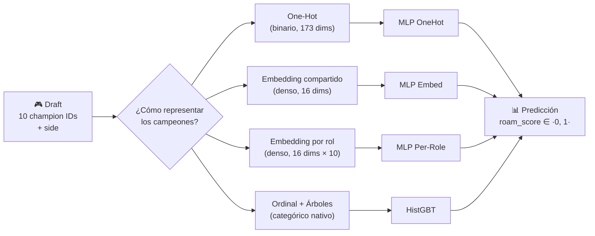

---

### 1.2. Baseline: Champion Mean

El modelo más simple posible. No es un modelo de ML: es una **tabla de lookup**.

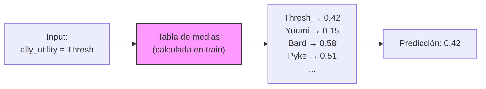

**Cómo funciona:**
1. Durante "entrenamiento": calcula la media de `support_roam_score` para cada campeón de support en el dataset de train
2. Durante predicción: dado un draft, busca qué campeón juega de support aliado y devuelve su media histórica
3. Si el campeón no se vio en train → devuelve la media global

**¿Por qué es importante?** Porque marca un **suelo de comparación**. Si un modelo sofisticado no supera una tabla de medias, no está aprendiendo nada útil del resto del draft.

| Métrica (test) | Valor |
|---|---:|
| R² | 0.125 |
| Spearman | 0.336 |
| MAE | 0.144 |

---

### 1.3. HistGradientBoosting (GBT) — El modelo tabular

#### ¿Qué es un Gradient Boosted Tree?

Es un **conjunto (ensemble) de árboles de decisión** que se construyen de forma secuencial. Cada nuevo árbol intenta corregir los errores del conjunto anterior.

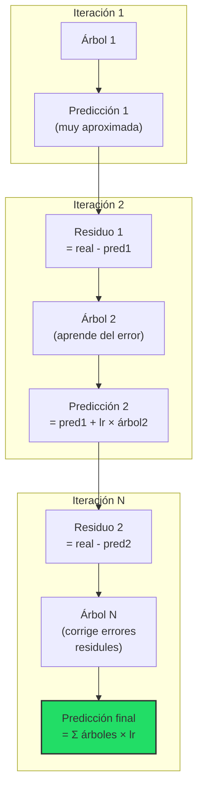

#### ¿Cómo trata los campeones?

`HistGradientBoosting` de sklearn tiene **soporte nativo para categóricas**. No necesita one-hot ni embeddings. Internamente:

1. Ordena los campeones por su valor medio del target
2. En cada split del árbol, agrupa campeones en dos subconjuntos
3. Busca el split que maximice la reducción de error

```
Ejemplo de un nodo del árbol:

         ¿ally_utility ∈ {Bard, Pyke, Thresh, Alistar}?
              /                          \
            SÍ                           NO
        (roamers)                    (enchanters/otros)
        score ↑ +0.08                score ↓ -0.03
```

#### Un árbol individual podría verse así:

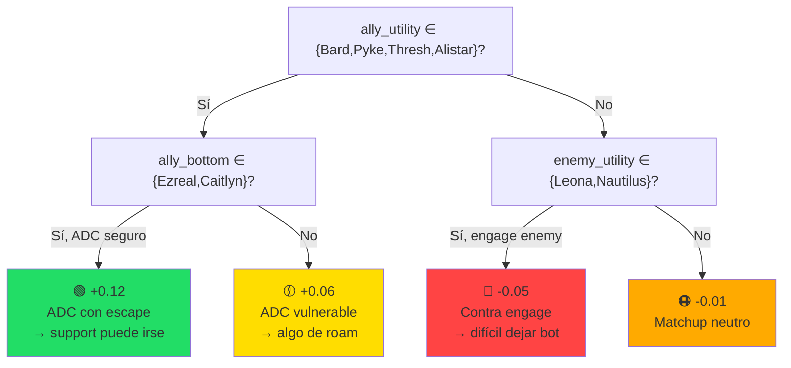

> [!NOTE]
> En realidad el modelo usa **300 árboles** (max_iter=300) con profundidad máxima 6, cada uno con hasta 31 hojas. La predicción final es la suma ponderada de todos ellos. Cada árbol individual aporta poco, pero el conjunto captura interacciones complejas.

#### Hiperparámetros del GBT en el proyecto

| Parámetro | Valor | Significado |
|---|---:|---|
| max_iter | 300 | Número de árboles |
| max_depth | 6 | Profundidad máxima por árbol |
| learning_rate | 0.05 | Cuánto "peso" tiene cada nuevo árbol |
| min_samples_leaf | 50 | Mínimo de observaciones por hoja |
| max_leaf_nodes | 31 | Máximo de hojas por árbol |

#### Ventajas del GBT para este problema
- Maneja categóricas de forma nativa (no necesita one-hot ni embeddings)
- Captura interacciones no lineales automáticamente (p.ej. "Thresh + Ezreal → mucho roam" sin necesidad de codificarlo explícitamente)
- No necesita normalización, es robusto a outliers
- Rápido de entrenar (~30 segundos en 268K filas)

---

### 1.4. MLP OneHot — La red neuronal básica

#### ¿Qué es un MLP?

Un **Multi-Layer Perceptron** es una red neuronal feedforward compuesta de capas de neuronas densamente conectadas.

#### ¿Cómo codifica los campeones?

Cada campeón se convierte en un **vector binario one-hot** de dimensión 173 (= número de campeones en el dataset).

```
Ejemplo: Thresh tiene ID → índice 87 en el vocabulario

One-hot(Thresh) = [0, 0, 0, ..., 0, 1, 0, ..., 0]
                   ↑                 ↑ posición 87
                   173 dimensiones
```

Para los 10 slots del draft, se concatenan 10 vectores one-hot + el lado:

```
Input = [one_hot(ally_top) | one_hot(ally_jg) | ... | one_hot(enemy_util) | side]
         ←── 173 ──→         ←── 173 ──→               ←── 173 ──→        ← 1 →
                                                                    
Total: 10 × 173 + 1 = 1.731 dimensiones de entrada
```

#### Arquitectura completa

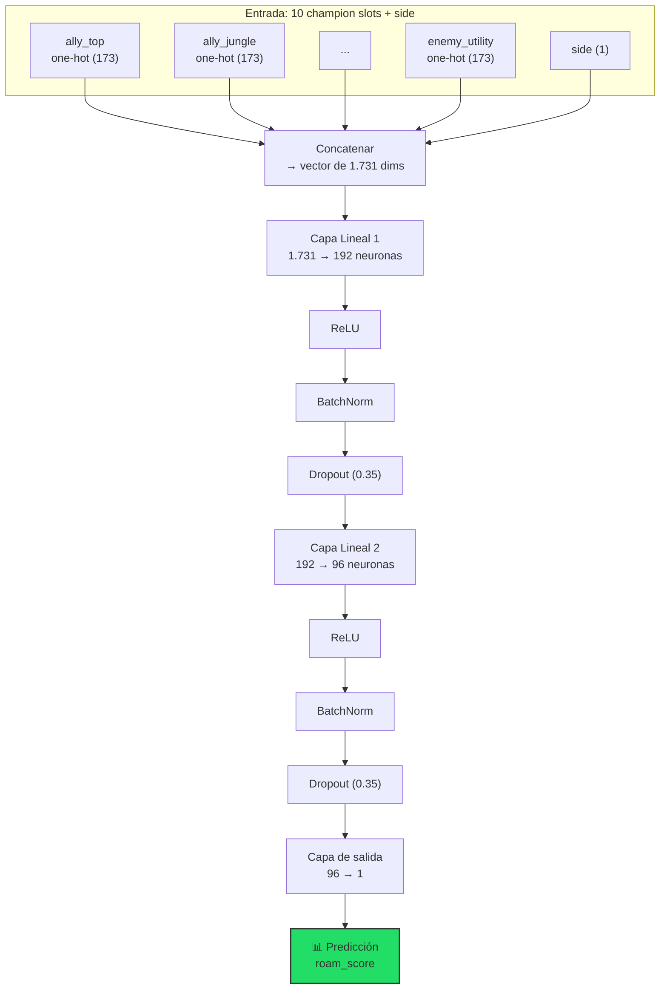

#### Los componentes uno a uno

| Componente | ¿Qué hace? | ¿Por qué? |
|---|---|---|
| **Capa Lineal** | `y = Wx + b` — transformación lineal | Aprende combinaciones de features |
| **ReLU** | `max(0, x)` — activación no lineal | Permite al modelo aprender relaciones no lineales. Sin ella, N capas lineales equivalen a 1 sola |
| **BatchNorm** | Normaliza las activaciones por mini-batch | Estabiliza el entrenamiento, permite learning rates más altos |
| **Dropout (0.35)** | Apaga aleatoriamente el 35% de neuronas en cada paso | Regularización: evita que el modelo memorice el train. Fuerza redundancia |

#### Problema del One-Hot

Con 173 dimensiones por slot y 10 slots, la primera capa tiene **1.731 × 192 = 332.352 pesos** solo para esa conexión. Es un modelo enorme (351K parámetros totales) para la señal disponible, que es débil. Consecuencia: **overfitting rápido** (best epoch = 6 de 150).

Además, todos los campeones están **equidistantes** en el espacio one-hot:

```
distancia(Thresh, Pyke)  = √2   ← roamers similares
distancia(Thresh, Yuumi) = √2   ← totalmente opuestos
distancia(Pyke, Yuumi)   = √2   ← MISMA distancia

→ El modelo no tiene ninguna pista de qué campeones son similares.
  Debe aprender TODA la estructura desde cero.
```

---

### 1.5. MLP con Embeddings Compartidos — Aprendiendo representaciones

#### La idea clave

En lugar de usar vectores binarios de 173 dimensiones, **comprimimos** cada campeón en un vector denso de solo **16 dimensiones** que se aprende durante el entrenamiento.

#### ¿Qué es un Embedding técnicamente?

```python
self.embed = nn.Embedding(num_embeddings=173, embedding_dim=16, padding_idx=0)
```

Es una **tabla de lookup entrenable**: una matriz **E ∈ ℝ^{173 × 16}**.

```
     dim 1  dim 2  dim 3  ...  dim 16
      ↓      ↓      ↓           ↓
Thresh  [ 0.23, -0.41,  0.87, ...,  0.12]   ← vector de Thresh
Pyke    [ 0.19, -0.38,  0.91, ...,  0.08]   ← vector de Pyke (¡cercano a Thresh!)
Yuumi   [-0.72,  0.55, -0.33, ..., -0.61]   ← vector de Yuumi (¡lejos de ambos!)
Bard    [ 0.31, -0.29,  0.78, ...,  0.22]   ← vector de Bard (cercano a roamers)
...
173 filas × 16 columnas = 2.768 parámetros
```

#### ¿Cómo funciona la tabla de lookup?

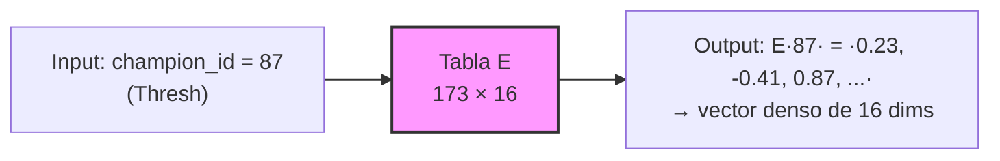

Es equivalente matemáticamente a multiplicar one-hot × E:

```
one_hot(87) × E = [0,0,...,1,...,0] × E = fila 87 de E
```

Pero **la dimensión reducida (173 → 16) es la diferencia crucial**: fuerza al modelo a codificar información útil en solo 16 números. Esto actúa como un **cuello de botella informacional** que obliga a agrupar campeones similares.

#### ¿Cómo se entrenan los embeddings?

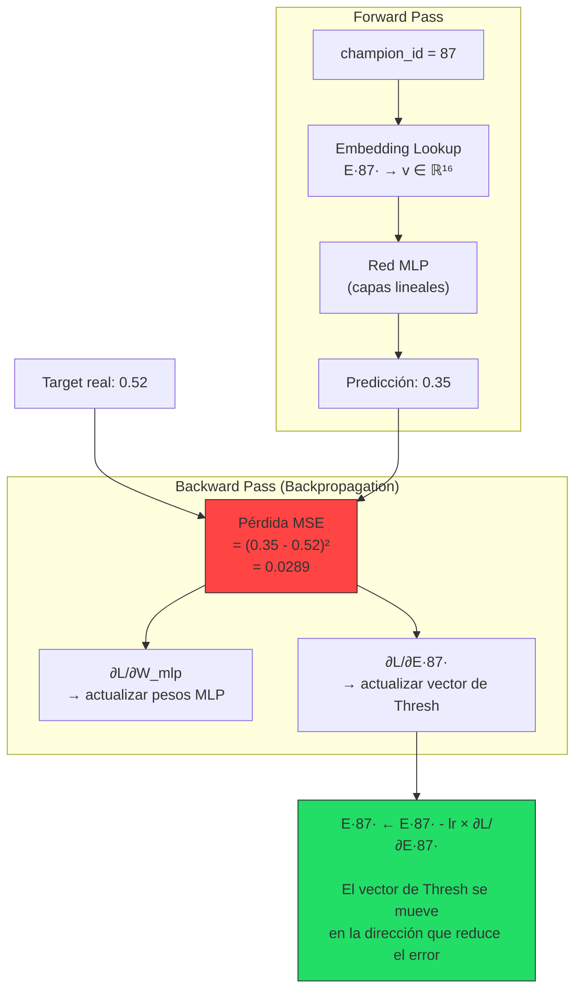

> [!IMPORTANT]
> **El embedding se entrena con el mismo optimizador (AdamW) y la misma learning rate que el resto de la red.** No hay nada especial: forma parte de `model.parameters()` y recibe gradientes como cualquier otro peso.

#### ¿Por qué convergen los campeones similares?

**Intuición con ejemplo numérico:**

1. El modelo ve muchas partidas con Thresh (roamer) → aprende que su vector debe empujar la predicción hacia scores altos
2. También ve muchas partidas con Pyke (roamer) → aprende algo parecido
3. Como ambos empujan en la misma dirección, sus vectores convergen hacia la misma zona del espacio de 16 dimensiones
4. Yuumi (anti-roamer) empuja en dirección opuesta → su vector queda lejos

```
Después del entrenamiento:

                    dim 1
                      ↑
         Yuumi •      |
               Lulu • |
                      |
         ────────────────────→ dim 2
                      |
                      |    • Thresh
                      |  • Pyke    • Bard
                      |      • Alistar
```

#### Arquitectura completa del MLP Embed

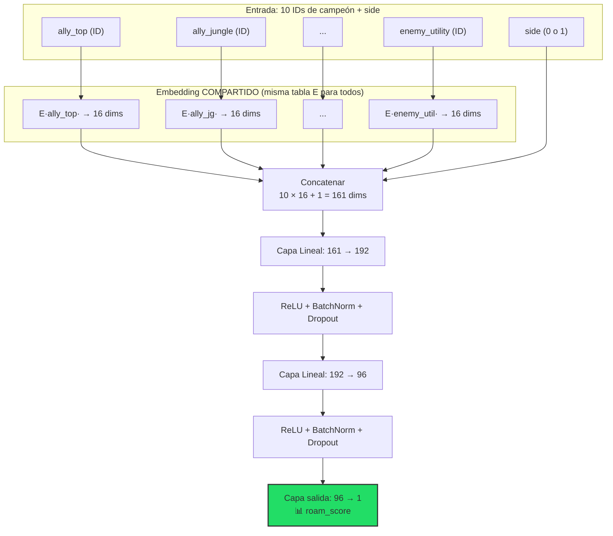

**Parámetros totales: ~53K** (vs 351K del OneHot). 6.6× menos parámetros.

#### Limitación: "Compartido" = mismo vector para todos los roles

El vector de Thresh es el **mismo** independientemente de si Thresh es:
- Ally support (su rol natural → muy relevante)
- Enemy support (matchup → relevante de otra manera)
- Ally top (off-meta → casi irrelevante)

La red debe aprender a interpretar el mismo vector en contextos diferentes solo por su **posición** en el input concatenado.

---

### 1.6. MLP Per-Role + Interactions — El modelo más expresivo

#### La mejora: un embedding diferente para cada slot

En lugar de 1 tabla compartida, se crean **10 tablas independientes** (una por slot del draft):

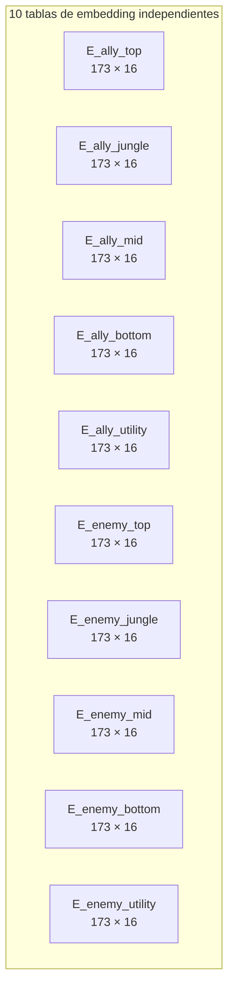

Ahora, **Thresh como ally support** y **Thresh como enemy support** tienen vectores completamente diferentes:

```
E_ally_utility[Thresh]  = [0.23, -0.41, 0.87, ...]   ← "Thresh en mi equipo como support"
E_enemy_utility[Thresh] = [0.11,  0.33, 0.22, ...]   ← "Thresh en el equipo rival como support"

→ El modelo puede aprender que "tener Thresh de support aliado"
  y "enfrentarse a Thresh enemigo" tienen efectos diferentes
  sobre el roaming de MI support.
```

#### Las interacciones explícitas (Dot Products)

Además de los embeddings por rol, se calculan **2 productos punto** que capturan relaciones entre slots:

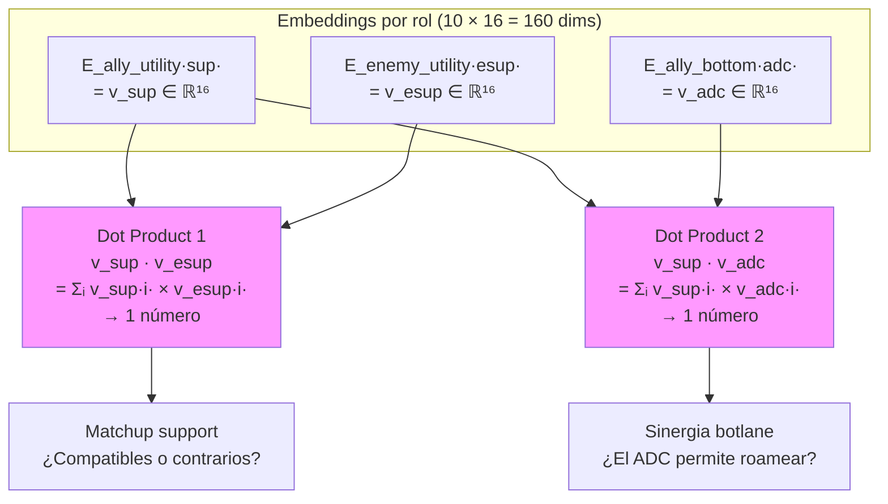

**¿Qué mide el dot product?**

```
dot(v_sup, v_esup) = alto positivo → los vectores apuntan en la misma dirección
                                    → "matchup neutral / similar"
                   = alto negativo → vectores opuestos
                                    → "matchup polarizado"
                   = cercano a 0   → vectores ortogonales
                                    → "sin relación clara"
```

Es una medida de **similitud bilineal** aprendida entre los dos campeones, codificada en sus embeddings.

#### Arquitectura completa

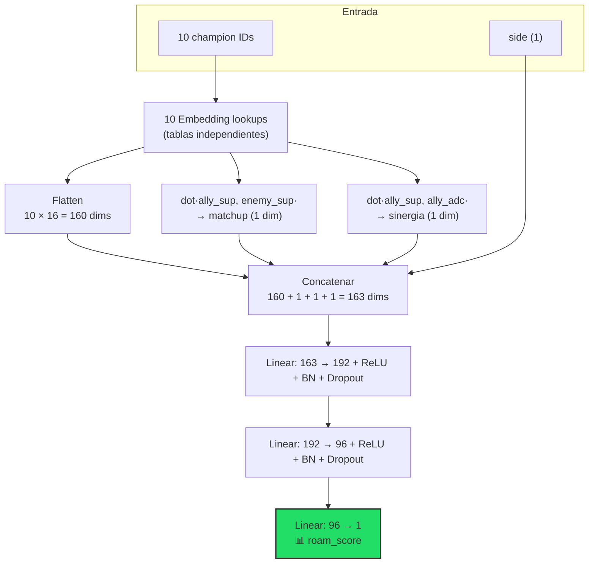

**Parámetros totales: ~78K** (53K embed + 25K cabeza MLP).

---

### 1.7. Comparativa visual de las 4 representaciones

````carousel
### One-Hot: todos equidistantes

```
Thresh  [0,0,...,1,...,0]  ─── √2 ───  Pyke  [0,0,...,1,...,0]
                            \                /
                          √2  \            / √2
                               \          /
                            Yuumi [0,0,...,1,...,0]

→ El modelo NO SABE que Thresh y Pyke son similares.
  Debe aprenderlo desde cero con 332K parámetros.
```

<!-- slide -->

### Embedding Compartido: similitudes aprendidas

```
         espacio de 16 dimensiones
         
         Yuumi ●          ← lejos de roamers
         Lulu ●
         
         ─────────────────────────
         
                    ● Thresh    ← cerca entre sí
                  ● Pyke
                ● Bard
              ● Alistar
         
→ MISMA representación sin importar el rol/lado.
  2.768 parámetros para la tabla.
```

<!-- slide -->

### Embedding Per-Role: especialización por posición

```
Tabla ally_utility:        Tabla enemy_utility:
  Thresh → [0.23, -0.41...]  Thresh → [0.11, 0.33...]
  Pyke   → [0.19, -0.38...]  Pyke   → [0.05, 0.28...]
  
→ "Thresh como MI support" ≠ "Thresh como support RIVAL"
  10 × 2.768 = 27.680 parámetros para embeddings.
```

<!-- slide -->

### HistGBT: categóricas nativas, sin representación explícita

```
       ¿ally_utility ∈ {Bard, Pyke, Thresh}?
              /                    \
            SÍ                     NO
     ¿ally_bottom ∈ {Ez,Cait}?   ¿enemy_util ∈ {Leona,Naut}?
        /        \                    /          \
      +0.12    +0.06              -0.05        -0.01

→ El árbol descubre agrupaciones óptimas automáticamente.
  No necesita representación vectorial.
  300 árboles × max 31 hojas cada uno.
```
````

### 1.8. Tabla resumen de arquitecturas

| | Champion Mean | HistGBT | MLP OneHot | MLP Embed | MLP Per-Role |
|---|---|---|---|---|---|
| **Tipo** | Lookup table | Ensemble de árboles | Red neuronal | Red neuronal | Red neuronal |
| **Representación** | — | Categórica nativa | One-hot (173d) | Embedding compartido (16d) | Embedding por rol (16d × 10) |
| **Input dim** | 1 | 31 categóricas | 1.731 | 161 | 163 |
| **Parámetros** | 0 | ~300 árboles | ~351K | ~53K | ~78K |
| **Interacciones** | Ninguna | Automáticas (splits) | Implícitas (capas) | Implícitas (capas) | Explícitas (dot) + implícitas |
| **Best epoch** | — | — | 6/150 ⚠️ | 18/150 | 17/150 |
| **R² (test)** | 0.125 | 0.160 | 0.155 | 0.150 | 0.154 |
| **Spearman (test)** | 0.336 | 0.387 | 0.381 | 0.376 | 0.381 |

> [!WARNING]
> El best epoch de 6/150 en MLP OneHot indica **overfitting rápido**: el modelo tiene 351K parámetros para una señal débil (R²≈0.16). En 6 epochs aprende la señal y luego empieza a memorizar ruido. Los embeddings mitigan esto al tener 6-7× menos parámetros.

---

## Parte 2: El ICC (Coeficiente de Correlación Intraclase)

### 2.1. ¿Qué problema resuelve el ICC?

Pregunta central: **¿Cuánta variabilidad del roam_score se debe a la composición del draft y cuánta a la ejecución individual de cada partida?**

Si agrupamos todas las partidas que tienen **la misma botlane** (mismo support + mismo ADC), ¿los scores dentro de cada grupo son consistentes o varían mucho?

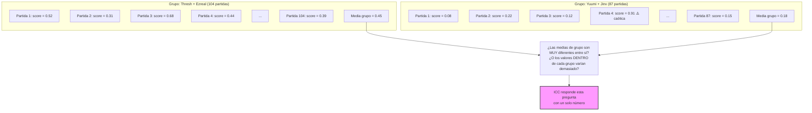

### 2.2. La descomposición de varianza (ANOVA)

El ICC se basa en descomponer la varianza total del roam_score en dos partes:

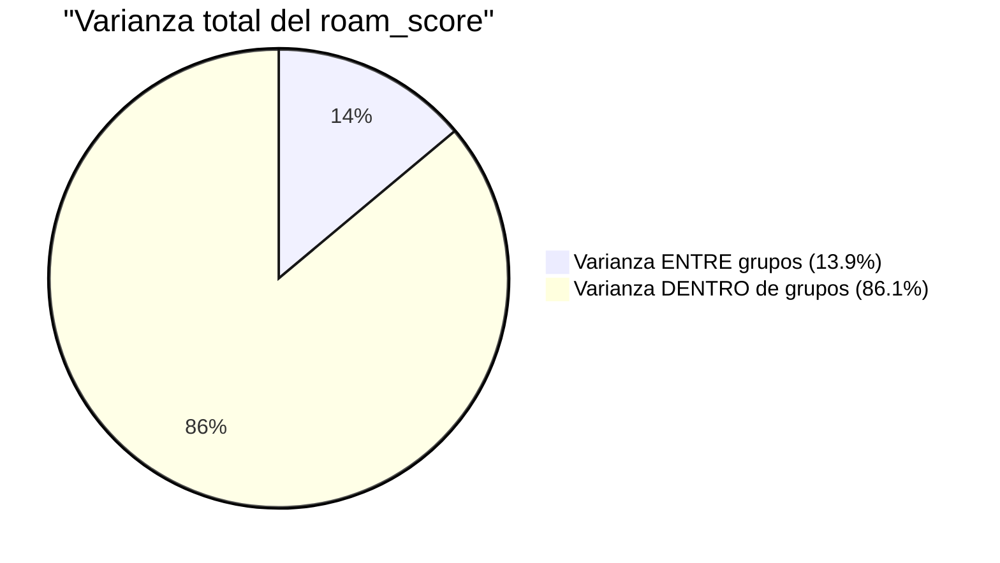

```
Varianza TOTAL = Varianza ENTRE grupos + Varianza DENTRO de grupos
                 (diferencias entre          (diferencias entre partidas
                  composiciones)              con la MISMA composición)
```

### 2.3. Fórmula del ICC(1)

Se calcula mediante ANOVA de un factor:

```
ICC(1) = (MSB - MSW) / (MSB + (k̄ - 1) × MSW)
```

Donde:
- **MSB** = Mean Square Between groups = varianza entre las medias de los grupos
- **MSW** = Mean Square Within groups = varianza dentro de cada grupo (promediada)
- **k̄** = tamaño medio de grupo

#### Ejemplo numérico con datos del proyecto

```
Agrupación: botlane_champions (support + ADC)
  → ~3.846 grupos únicos
  → ~67 partidas por grupo de media

  MSB (varianza entre Thresh+Ez, Yuumi+Jinx, ...) = X
  MSW (varianza dentro de las 67 partidas de Thresh+Ez) = Y

  ICC = (X - Y) / (X + 66 × Y) = 0.139
```

**ICC = 0.139 significa**: solo el **13.9%** de la variabilidad total del roam_score se explica por qué botlane se jugó. El **86.1%** restante varía entre partidas con la misma composición.

### 2.4. ICC vs R² Group-Mean: ¿Cuál es la diferencia?

Son dos formas de responder a la misma pregunta, pero con matices:

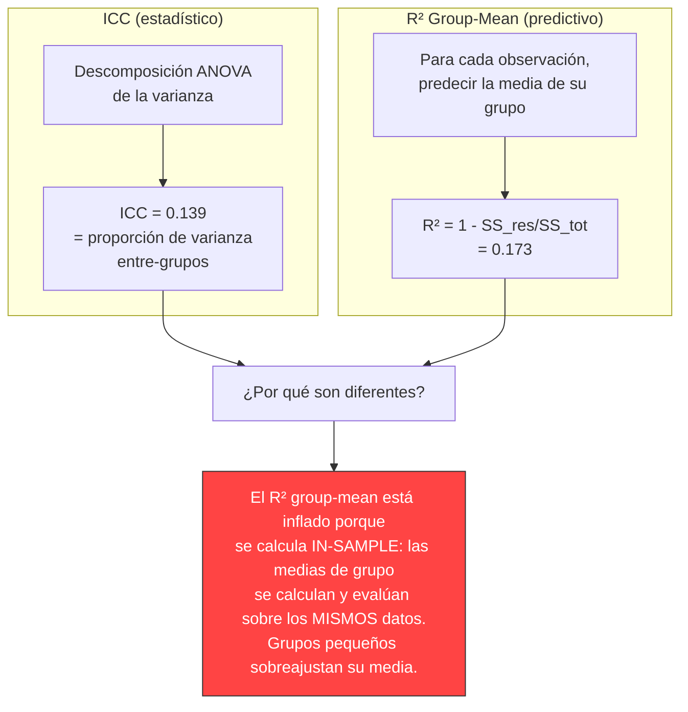

| | ICC | R² Group-Mean |
|---|---|---|
| **Qué mide** | Consistencia intraclase (varianza explicada teórica) | Varianza explicada al predecir la media del grupo |
| **Sesgo** | Corregido por ANOVA (ajusta por tamaño de grupo) | **Sesgado hacia arriba** (in-sample) |
| **Valor (botlane+side)** | 0.139 | 0.173 |
| **Interpretación** | Más conservador, más honesto | Optimista, especialmente con grupos pequeños |
| **Cuál usar como "techo"** | ✅ Más apropiado | ⚠️ Solo si se recalcula out-of-sample |

> [!IMPORTANT]
> **Para el tutor**: "El ICC y el R² group-mean son dos medidas relacionadas pero distintas. El ICC (0.139) estima la proporción de varianza que es estable por composición, corregida por ANOVA. El R² (0.173) mide cuánto predice una tabla de medias por grupo, pero tiene sesgo in-sample. No 'sacamos un R² del ICC' — son cálculos paralelos sobre las mismas agrupaciones."

### 2.5. ¿Qué significan los resultados del ICC para el proyecto?

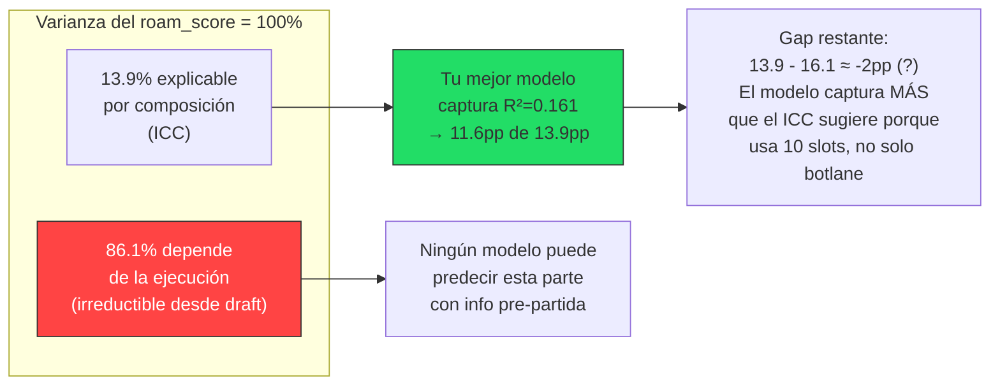

> [!NOTE]
> Que el modelo (R²=0.161) supere el ICC de botlane (0.139) no es una contradicción. El ICC de botlane solo considera 2 campeones. El modelo usa **10 campeones + lado** → puede capturar señal adicional de los otros 8 slots. Lo coherente es que el R² del modelo quede **entre** el ICC de botlane (0.139) y el R² group-mean de botlane+side (0.173).

---

## Parte 3: ¿Por qué R² y Spearman? (y MAE)

### 3.1. Las tres métricas miden cosas diferentes

```mermaid
graph TD
    subgraph "R² — ¿Cuánta varianza explico?"
        R2["R² = 1 - Σ(yᵢ - ŷᵢ)² / Σ(yᵢ - ȳ)²"]
        R2 --> R2I["Compara el error del modelo\ncon el error de predecir\nsiempre la media"]
        R2I --> R2V["R² = 0.161\n→ El modelo explica el 16.1%\nde la varianza del score"]
    end
    
    subgraph "Spearman — ¿Ordeno bien los drafts?"
        SP["ρ = correlación de Pearson\nsobre los RANGOS"]
        SP --> SPI["No importa el valor exacto.\n¿Los drafts con scores altos\nreciben predicciones altas?"]
        SPI --> SPV["Spearman = 0.388\n→ Correlación moderada\nentre ranking real y predicho"]
    end
    
    subgraph "MAE — ¿Cuánto me equivoco en promedio?"
        MAE["MAE = media de |yᵢ - ŷᵢ|"]
        MAE --> MAEI["Error absoluto medio.\nMuy interpretable:\nen la escala del target."]
        MAEI --> MAEV["MAE = 0.141\n→ Me equivoco ±14.1\npuntos en escala 0-100"]
    end
    
    style R2V fill:#69f
    style SPV fill:#f96
    style MAEV fill:#6d6
```

### 3.2. ¿Por qué necesitamos las tres?

Cada una responde a una pregunta distinta y puede dar información diferente:

#### Escenario 1: R² alto pero Spearman bajo
```
Modelo A predice:  [0.40, 0.41, 0.39, 0.42, 0.38]
Valores reales:    [0.10, 0.90, 0.30, 0.70, 0.50]

→ R² puede ser positivo (las predicciones están "cerca de la media real")
→ Spearman ≈ 0 (el ORDEN está completamente mal)
→ El modelo colapsa a predecir siempre ~0.40 sin discriminar
```

#### Escenario 2: Spearman alto pero R² bajo
```
Modelo B predice:  [0.20, 0.80, 0.30, 0.70, 0.50]  (multiplicado × 2)
Valores reales:    [0.10, 0.40, 0.15, 0.35, 0.25]

→ Spearman = 1.0 (el ORDEN es perfecto)
→ R² < 0 (los valores están muy lejos de los reales)
→ El modelo ordena bien pero exagera las diferencias
```

#### En tu proyecto:

```
R² = 0.161   → "Explico el 16.1% de la varianza"
Spearman = 0.388 → "Ordeno razonablemente los drafts"
MAE = 0.141  → "En promedio me equivoco ±0.14 en [0,1]"

Las tres cuentan una historia COHERENTE:
→ Señal parcial, ranking moderado, error contenido.
```

### 3.3. ¿Por qué R² y no solo MSE/RMSE?

```
MSE = 0.0304    ← ¿Esto es bueno o malo? No tengo referencia.

R² = 1 - MSE/Var(y) = 1 - 0.0304/0.0363 = 0.161
                                    ↑
                              varianza del target

→ R² NORMALIZA el error por la varianza del fenómeno.
  0.161 significa "16.1% mejor que predecir siempre la media".
  Es INTERPRETABLE sin conocer la escala del target.
```

### 3.4. ¿Por qué Spearman y no Pearson?

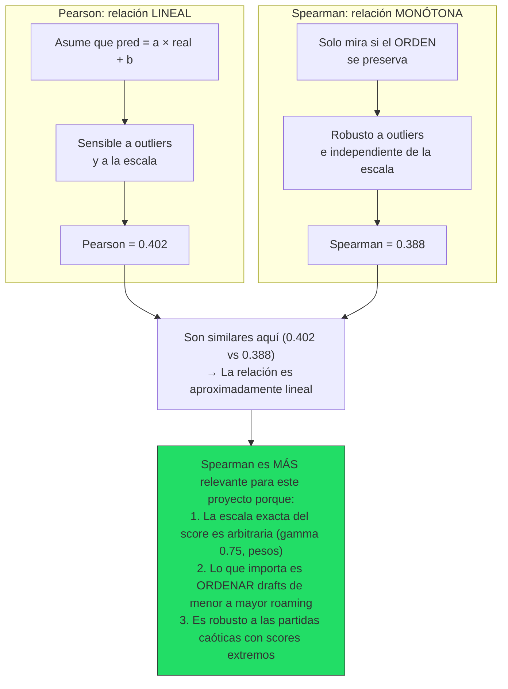

### 3.5. ¿Y el MAE? ¿Por qué darle más importancia?

El MAE es la métrica **más interpretable** para el tribunal:

```
MAE = 0.141 en escala [0, 1]

Traducción: "En promedio, la predicción del modelo se desvía
            0.14 puntos del valor observado. En una escala
            de 0 a 100, es un error de ±14 puntos."

Comparación:
  • Global Mean:    MAE = 0.155  (predecir siempre la media)
  • Champion Mean:  MAE = 0.144  (tabla de medias por campeón)
  • Mejor modelo:   MAE = 0.141  (HistGBT)

→ Mejora absoluta sobre Champion Mean: solo 0.003 (3 milésimas)
→ Mejora absoluta sobre Global Mean:   0.014 (1.4 puntos %)

El MAE es HONESTO: muestra que la mejora incremental del ML
sobre una tabla de medias es pequeña en términos absolutos.
```

> [!TIP]
> **Métrica complementaria más intuitiva**: "El 74.2% de las predicciones están dentro de ±0.20 del valor real, y el 41.8% dentro de ±0.10". Esto es mucho más fácil de entender para un tribunal que "R²=0.161".

### 3.6. Resumen: qué aporta cada métrica

| Métrica | Pregunta que responde | Valor | Interpretación |
|---|---|---:|---|
| **R²** | ¿Cuánta varianza explico vs. predecir la media? | 0.161 | 16.1% de varianza explicada — cerca del techo (~0.17) |
| **Spearman** | ¿Ordeno bien los drafts de menos a más roaming? | 0.388 | Correlación moderada — el ranking tiene sentido |
| **MAE** | ¿Cuánto me equivoco en promedio? | 0.141 | Error de ±14.1 puntos en [0, 100] |
| **within ±0.10** | ¿Cuántas predicciones son "muy precisas"? | 41.8% | 4 de cada 10 predicciones aciertan ±10 puntos |
| **within ±0.20** | ¿Cuántas predicciones son "razonables"? | 74.2% | 3 de cada 4 predicciones están dentro de ±20 puntos |

---

## Resumen visual final

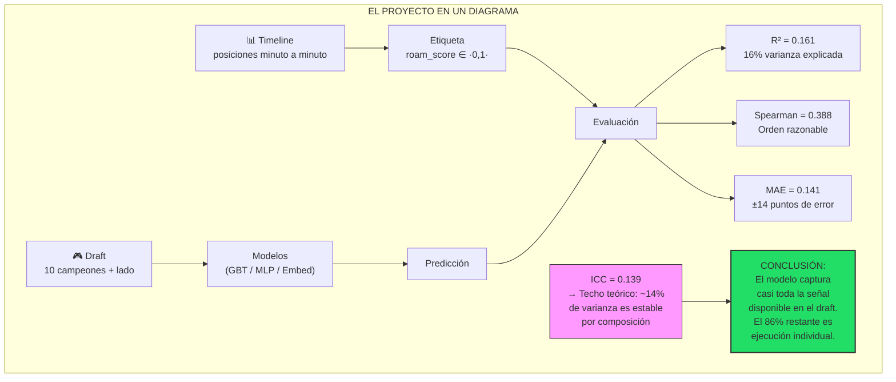
